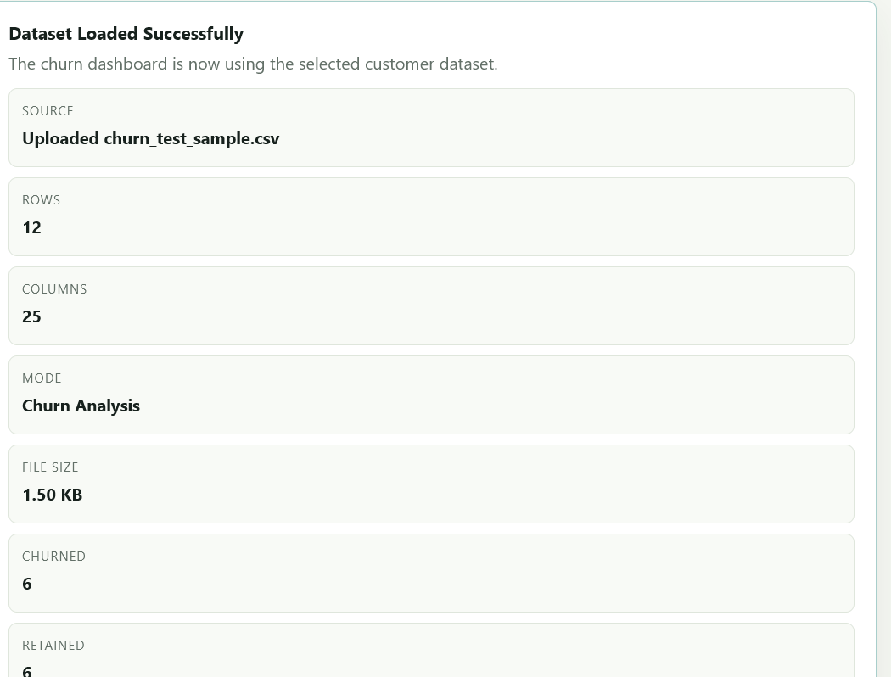

# Customer Churn Prediction & Analytics

SQL-based customer churn analytics project using the Telco Customer Churn dataset. The project includes SQL analysis, a browser dashboard, and an optional Python machine learning extension.


<p align="center">


</p>

<p align="center">
<a href="https://customer-churn-analytics-ksvy-bsr4du1js.vercel.app">

</a>
</p>

## ✨ Features

- 📊 Predict customer churn using a machine learning model.
- ⚡ Interactive web application built with Streamlit.
- 📁 Upload customer datasets for analysis.
- 📈 Generate real-time churn predictions.
- 🤖 XGBoost-powered classification model.
- 📋 View prediction results in an intuitive dashboard.
- 📥 Export prediction results for further analysis.
- 🔍 Analyze customer behavior to identify churn risk.
- 📂 Excel file support using OpenPyXL.
- 🚀 Fast and user-friendly interface.

## 🛠️ Tech Stack

| Category                 | Technologies                 |
| ------------------------ | ---------------------------- |
| **Programming Language** | Python                       |
| **Machine Learning**     | Scikit-learn, XGBoost        |
| **Data Analysis**        | Pandas                       |
| **Data Processing**      | OpenPyXL                     |
| **Web Framework**        | Streamlit                    |
| **Database**             | SQL                          |
| **Dataset**              | Telco Customer Churn Dataset |
| **Version Control**      | Git, GitHub                  |
| **Deployment**           | Vercel                       |


  
## Dashboard Screenshot



## Project Structure 
```text
customer-churn-analytics/
│
├── 📂 data/
├── 📂 docs/
│   └── screenshots/
├── 📂 live_app/
├── 📄 Customer_Churn_SQL_Project.sql
├── 📄 Customer_Churn_ML_Model.py
├── 📄 requirements.txt
├── 📄 README.md
└── 📄 LICENSE
```


## 🚀 Run the Application

### 1. Clone the Repository

```bash
git clone https://github.com/kundanmrj5-dev/customer-churn-analytics-.git
cd customer-churn-analytics-
```

### 2. Install Dependencies

```bash
pip install -r requirements.txt
```

### 3. Launch the Streamlit Dashboard

```bash
streamlit run streamlit_app.py
```

Once the server starts, open the URL displayed in your terminal (typically `http://localhost:8501`) in your web browser.

Alternatively, access the deployed application here:

**🌐 Live Demo:** https://customer-churn-analytics-ksvy-bsr4du1js.vercel.app


## 🗄️ SQL Analysis

The SQL module performs end-to-end business analytics on the Telco Customer Churn dataset, including:

* 📊 Customer segmentation
* 📉 Churn rate analysis
* 💰 Revenue loss estimation
* 🌐 Internet service analysis
* 💳 Payment method analysis
* 📞 Tech support impact analysis
* ⏳ Tenure-based churn analysis
* ⚠️ High-risk customer identification
* 💡 Business recommendations for customer retention


## 🤖 Train & Evaluate the Machine Learning Model

Run the following commands to install the required dependencies and evaluate the customer churn prediction models.

```bash
pip install -r requirements.txt
python Customer_Churn_ML_Model.py
## Streamlit App

## 🌐 Launch the Streamlit Dashboard

Start the interactive dashboard:

```bash
streamlit run streamlit_app.py
```

### Dashboard Features

* 📂 Upload CSV or Excel datasets
* 📊 Explore interactive charts
* 🤖 Predict customer churn
* ⚠️ Identify high-risk customers
* 💡 Generate business insights
* 📈 View churn metrics and analytics

## Workflow 
            
Dataset
   │
   ▼
Data Cleaning
   │
   ▼
Feature Engineering
   │
   ▼
XGBoost Model
   │
   ▼
Prediction
   │
   ▼
Interactive Dashboard


## 📈 Results

The machine learning pipeline successfully trains and evaluates multiple classification models to predict customer churn. Model performance is assessed using **Accuracy**, **Precision**, **Recall**, **F1-Score**, and **ROC-AUC**. The best-performing model is automatically selected based on the highest ROC-AUC score.

### Performance Metrics

| Metric       | Description                                                                     |
| ------------ | ------------------------------------------------------------------------------- |
| 🎯 Accuracy  | Measures the overall percentage of correctly classified customers.              |
| 🎯 Precision | Measures how accurately the model identifies customers who are likely to churn. |

### Generated Outputs

After running the project, the following files are automatically generated:

* 📄 **model_metrics.csv** – Stores the evaluation metrics for all trained models.
* 📄 **high_risk_customers.csv** – Lists customers predicted to have a high probability of churn.

### Business Outcome

* 📊 Identifies customers with a high risk of churn.
* 💰 Estimates the business impact of customer churn.
* 🎯 Supports data-driven customer retention strategies.
* 📈 Helps businesses prioritize high-risk customers for proactive engagement.

## 👨‍💻 Author

**Kundan Pandey**

## 📄 License

This project is licensed under the **MIT License**. See the `LICENSE` file for more details.

